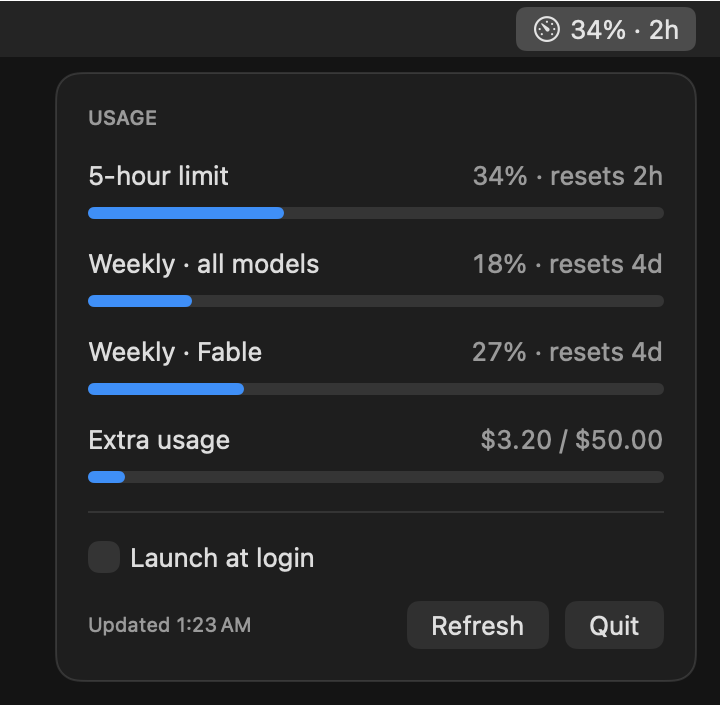

# Claude Usage

A tiny macOS menu bar app that shows your Claude plan usage — the same numbers as the usage panel in the Claude Code VS Code extension.

<p align="center"></p>

- **Menu bar:** a gauge icon and the most loaded limit, e.g. `11% · 6d` (percent · time until reset)
- **Popover:** 5-hour limit, weekly limit for all models, per-model weekly limits (e.g. Fable) and extra usage, each with a progress bar
- **Notifications** when a limit crosses 80% and 95% (once per limit window)
- **Launch at login** checkbox
- English and Russian UI (follows the system language)

No Dock icon, no settings window, no dependencies — a single Swift file.

## Requirements

- macOS 13 or later
- Xcode Command Line Tools (`xcode-select --install`)
- [Claude Code](https://claude.com/claude-code) signed in with a Claude subscription

## Build and install

```sh
./build.sh
cp -R ClaudeUsage.app /Applications/
open /Applications/ClaudeUsage.app
```

On first launch macOS asks for permission to show notifications. Enable **Launch at login** from the popover of the copy in `/Applications`.

## How it works

The app makes no requests to Claude models and uses no tokens. It reads data in this order:

1. **Claude Code's cache.** Claude Code stores the latest usage response in `~/.claude.json` (`cachedUsageUtilization`). The app reads this file every minute and whenever the popover opens — no network requests.
2. **Usage API as a fallback.** If the cached data is older than 10 minutes (for example, Claude Code is not running), the app calls `https://api.anthropic.com/api/oauth/usage` with the OAuth token Claude Code keeps in the Keychain (`Claude Code-credentials`). At most one request per 5 minutes; after HTTP 429 it backs off for 5 → 10 → 20 → 40 → 60 minutes.

The token is read via `/usr/bin/security`, is never written anywhere and is sent only to `api.anthropic.com`. The app never refreshes the token itself — if it has expired, just open Claude Code.

## Project files

| File | Purpose |
| --- | --- |
| `main.swift` | The whole app (SwiftUI `MenuBarExtra`) |
| `build.sh` | Compiles with `swiftc` and assembles `ClaudeUsage.app` |
| `make_icon.swift` | Draws the app icon; run `swift make_icon.swift && iconutil -c icns AppIcon.iconset` to regenerate `AppIcon.icns` |
| `AppIcon.icns` | App icon |
| `tools/snapshot.swift` | Renders `screenshot.png` with sample data (build command at the top of the file) |

## Disclaimer

Unofficial project, not affiliated with Anthropic. It relies on an undocumented endpoint and on Claude Code's internal cache format, both of which may change without notice.
